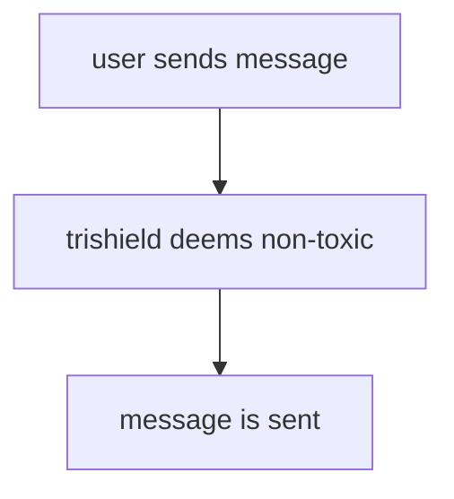
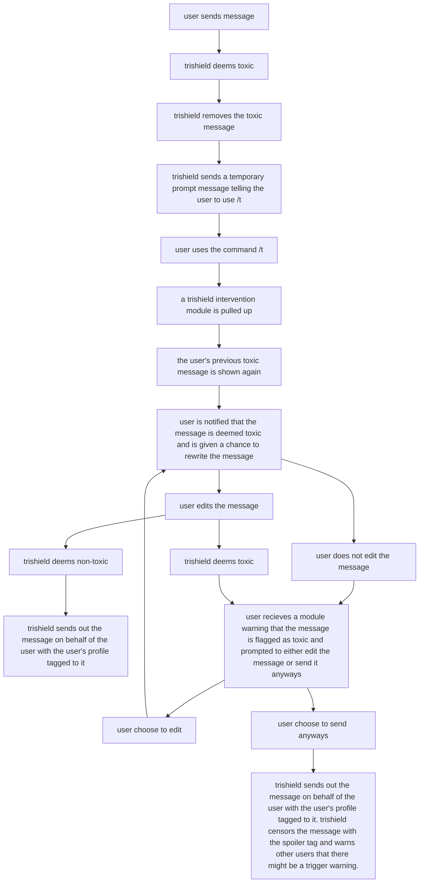

# **Guide on Trishield**

## 1. How to set up the bot
### After cloning the repositiory, create a .env file. In the .env file, add the following line.

```
DISCORD_TOKEN=<your-token-here>
```

### Your 'DISCORD_TOKEN' can be found after creating an application here https://discord.com/developers/applications. 
### For a detailed guide on how to create a new application on discord and retrieve the 'DISCORD_TOKEN', please refer to https://realpython.com/how-to-make-a-discord-bot-python/#creating-an-application.

### You may also need to install nltk, google api client among other things if they are not yet installed. 

## 2. How to use the bot

### Run the bot by running the file 'main.py'. If you get the message *TrishieldBot#XXX is now running!* it means that the bot is successfully online and can be used.

## 3. What are the features
- Bot runs in the background, normal (non-toxic) messages are not affected.
- When the message includes something that is deemed toxic to the community, the bot will prompt the user to use the /t command to send the message. 
- Moderators are able to edit the banned word list (csv file) and change what words are banned and flagged.

## 4. Conversation Flow Examples
    
(1) Non-Toxic Messages



(2) Toxic Messages

