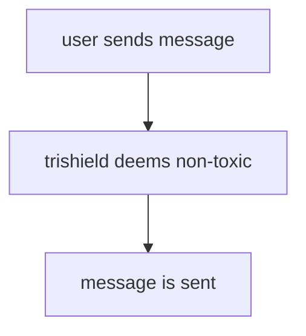
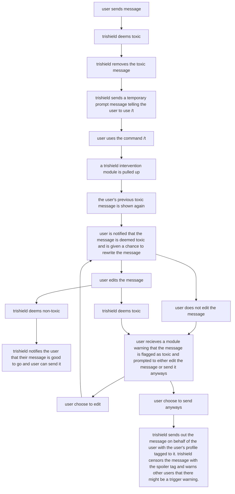

# **TriShield Guide**

### 1. Basic Setup

First clone the repository using 
```https://github.com/Faith-Tan-Jia-Yi/trishield.git```

##### In order to use the bot, you will need to create your own Discord Token. 
Your Discord Token can be found after creating an application [here](https://discord.com/developers/applications). 
For a detailed guide on how to create a new application on Discord and retrieve the Discord Token, please refer to this [link](https://realpython.com/how-to-make-a-discord-bot-python/#creating-an-application).

Once you have your token, enter it into the .env file as shown below.
```
DISCORD_TOKEN=<your-token-here>
```
##### If you would like to enable toxicity detection using the Perspective API, you will need to create your own API key.[^1]
Follow this [link](https://developers.perspectiveapi.com/s/docs-get-started?language=en_US) to create your key. 

[^1]: Note: If you do not create an API Key, toggle toxicity detection off in the ```.env``` file by setting ```PERSPECTIVE=0```.

Once you have your token, enter it into the .env file as shown below.
```
PERSPECTIVE_TOKEN=<your-api-key-here>
```

##### Additional installation
Make sure you are in the project directory by using ```cd trishield``` before running the command below.

Run ```pip install -r requirements.txt``` to install all necessary libraries and modules.


### 2. Running the Bot
Make sure you are in the project directory by using ```cd trishield``` before running the command below.

Run the bot by running the file 'main.py': ```python main.py```. 

If you get the message *```TrishieldBot#____ is now running!```* it means that the bot is successfully online and is now active in the server.

### 3. Features
- Moderators are able to edit the banned word list [ban_list.csv](/ban_list.csv) and select which words are flagged.
- Bot runs in the background, normal, non-toxic messages (as defined by the mods) are not affected.
- When the message includes something that is deemed toxic to the community, the bot will prompt the user to reconsider sending the message by informing them that their message is toxic and asking them to edit it. 


#### Conversation Flow Examples
    
(1) Non-Toxic Messages



(2) Toxic Messages

